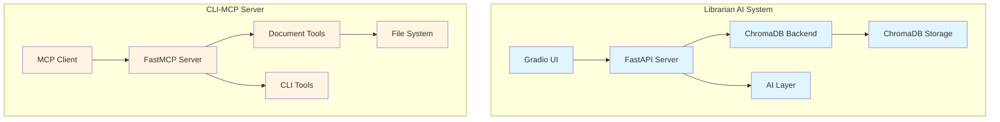
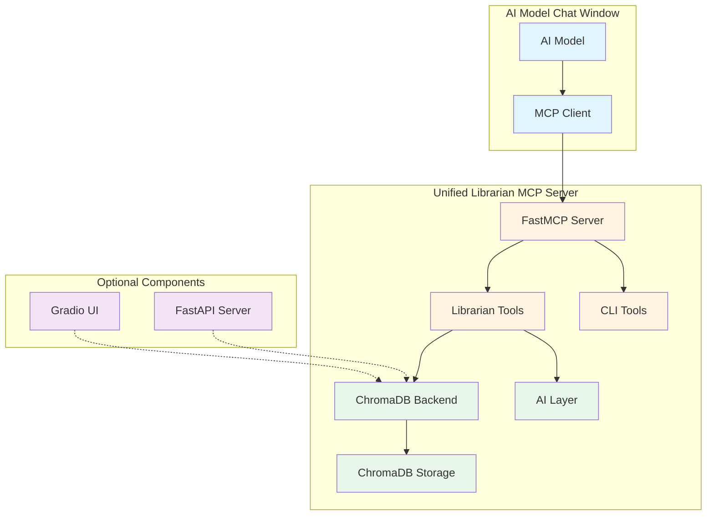

# Librarian MCP Integration - Architecture Analysis & Recommendations

## Executive Summary

This document provides a comprehensive analysis of merging the **Librarian AI** project with the **CLI-MCP-Duplicate** project to create a unified MCP (Model Context Protocol) server that enables AI models to act as librarians with document querying capabilities.

**Status**: Both projects are functional and ready for integration
**Deployment**: CLI-MCP is currently deployed on Jan
**Phase 1 Goal**: Create an MCP server that allows AI models to query the librarian system
**Phase 2 Goal**: Integrate Chonkie container for advanced chunking

---

## Project Overview

### 1. Librarian AI Project

**Location**: `/home/peter/development/librarian`

**Purpose**: Document processing and semantic search system with ChromaDB backend

**Key Components**:
- **API Layer**: FastAPI-based REST API ([`api-layer/main.py`](api-layer/main.py))
- **Backend**: ChromaDB for vector storage ([`api-layer/chroma_backend.py`](api-layer/chroma_backend.py))
- **Frontend**: Gradio UI for testing ([`api-layer/gradio_app.py`](api-layer/gradio_app.py))
- **AI Layer**: Query formatting and result aggregation ([`api-layer/ai_layer_interface.py`](api-layer/ai_layer_interface.py))

**Current Status**:
- ✅ Phase 1 MVP complete with ChromaDB backend
- ✅ Gradio UI running at `http://localhost:7860`
- ✅ Document upload, chunking, and semantic search functional
- ✅ AI aggregation layer for response synthesis
- ✅ Virtual environment setup with dependencies

**Technology Stack**:
- FastAPI (async web framework)
- ChromaDB (vector database)
- Gradio (UI framework)
- Python 3.13

---

### 2. CLI-MCP-Duplicate Project

**Location**: `/home/peter/development/librarian/cli-mcp-duplicate`

**Purpose**: Secure CLI and document access MCP server using FastMCP

**Key Components**:
- **MCP Server**: FastMCP-based server ([`cli_mcp_secure.py`](cli-mcp-duplicate/cli_mcp_secure.py))
- **Security**: Command whitelisting and directory sandboxing
- **Document Tools**: Read, list, search, and summarize documents
- **CLI Tools**: Secure command execution with timeout protection

**Current Status**:
- ✅ FastMCP integration complete
- ✅ Security restrictions implemented
- ✅ Document access tools functional
- ✅ Deployed on Jan and has been deployed on lmstudio.

**Technology Stack**:
- FastMCP (MCP server framework)
- Subprocess (command execution)
- Python 3.13

---

## Architecture Analysis

### Current Architecture



### Proposed Integrated Architecture



---

## Integration Strategy

### Phase 1: MCP Server Integration

**Objective**: Create a unified MCP server that provides librarian functionality to AI models

**Key Changes Required**:

1. **Merge MCP Server Structure**
   - Use FastMCP as the base framework (from CLI-MCP)
   - Integrate librarian tools into the MCP server
   - Maintain security features from CLI-MCP

2. **Librarian Tools for MCP**
   - `search_library(query, limit)` - Semantic search over documents
   - `upload_document(text, source)` - Add documents to library
   - `get_library_stats()` - Collection statistics
   - `delete_document(document_id)` - Remove documents

3. **Backend Integration**
   - Reuse existing ChromaDB backend from librarian
   - Maintain lazy initialization pattern
   - Keep AI layer for response aggregation

4. **Configuration**
   - Single configuration file for both systems
   - Environment variables for paths and settings
   - Unified logging and error handling

### Phase 2: Chonkie Integration

**Objective**: Replace ChromaDB's native chunking with Chonkie's advanced chunking

**Key Changes Required**:

1. **Chonkie Backend Implementation**
   - Implement `ChonkieBackend` class
   - Integrate with Chonkie API/container
   - Support multiple chunking strategies

2. **Migration Path**
   - Configurable backend selection
   - Data migration utilities
   - Backward compatibility with ChromaDB

---

## Technical Analysis

### 1. AsyncIO Conflicts

**Issue Identified**: Potential conflicts between FastAPI (async) and FastMCP (sync)

**Current State**:
- **FastAPI**: Uses async/await for all endpoints
- **FastMCP**: Uses synchronous tool implementations
- **ChromaDB**: Supports both sync and async operations

**Potential Conflicts**:
1. Event loop management when both systems run together
2. Blocking operations in async context
3. Resource contention between async and sync operations

**Recommended Solutions**:

#### Option A: Run in Separate Processes (Recommended)
```python
# MCP Server Process (sync)
# Runs FastMCP with librarian tools
python librarian_mcp.py

# Optional: FastAPI Server Process (async)
# Runs Gradio UI and REST API
python api-layer/main.py
```

**Pros**:
- No async/sync conflicts
- Independent scaling
- Clear separation of concerns
- Can run MCP server alone for production

**Cons**:
- Two processes to manage
- Need inter-process communication if needed
- Slightly more complex deployment

#### Option B: Async Wrapper for FastMCP
```python
import asyncio
from functools import wraps

def async_tool(func):
    @wraps(func)
    async def wrapper(*args, **kwargs):
        loop = asyncio.get_running_loop()
        return await loop.run_in_executor(None, func, *args, **kwargs)
    return wrapper

@mcp.tool()
@async_tool
def search_library(query: str, limit: int = 5) -> str:
    # Synchronous implementation
    return backend.query(query_text=query, limit=limit)
```

**Pros**:
- Single process
- Simpler deployment
- Direct access to both systems

**Cons**:
- Performance overhead from thread pool
- More complex error handling
- Potential deadlocks if not careful

**Recommendation**: Use **Option A** (separate processes) for Phase 1. This provides the cleanest architecture and avoids async conflicts entirely.

### 2. Dependency Management

**Current Dependencies**:

**Librarian Project**:
```txt
gradio>=4.0.0
chromadb>=0.4.0
fastapi>=0.100.0
uvicorn[standard]>=0.23.0
httpx>=0.25.0
```

**CLI-MCP Project**:
```txt
fastmcp
```

**Merged Dependencies**:
```txt
# Core MCP Server
fastmcp

# Librarian Backend
chromadb>=0.4.0

# Optional: REST API and UI (for testing)
gradio>=4.0.0
fastapi>=0.100.0
uvicorn[standard]>=0.23.0
httpx>=0.25.0

# Phase 2: Chonkie Integration
# chonkie-sdk  # To be added in Phase 2
```

**Recommendation**: Create a single `requirements.txt` with optional dependencies for different use cases.

### 3. File Structure

**Proposed Structure**:
```
librarian/
├── mcp-server/              # New: Unified MCP server
│   ├── __init__.py
│   ├── librarian_mcp.py      # Main MCP server
│   ├── tools/               # MCP tool implementations
│   │   ├── __init__.py
│   │   ├── librarian_tools.py    # Library-specific tools
│   │   └── cli_tools.py         # CLI tools (from CLI-MCP)
│   ├── backend/              # Backend implementations
│   │   ├── __init__.py
│   │   ├── chroma_backend.py     # ChromaDB backend
│   │   └── chonkie_backend.py    # Chonkie backend (Phase 2)
│   ├── ai_layer/            # AI layer for response synthesis
│   │   ├── __init__.py
│   │   └── ai_layer_interface.py
│   └── config/              # Configuration
│       ├── __init__.py
│       └── settings.py
├── api-layer/               # Existing: REST API and Gradio UI
│   ├── main.py
│   ├── gradio_app.py
│   └── ...
├── chroma_db/               # ChromaDB data
├── venv/                    # Virtual environment
├── requirements.txt          # Merged dependencies
├── setup_mcp.sh             # MCP server startup script
├── setup_full.sh            # Full system startup (MCP + API)
└── reco.md                  # This file
```

---

## Implementation Plan

### Phase 1: MCP Server Integration

#### Step 1: Create Unified MCP Server Structure
```bash
# Create new directory structure
mkdir -p mcp-server/{tools,backend,ai_layer,config}
```

#### Step 2: Implement Librarian Tools
Create [`mcp-server/tools/librarian_tools.py`](mcp-server/tools/librarian_tools.py):
```python
from fastmcp import FastMCP
from ..backend.chroma_backend import ChromaBackend
from ..ai_layer.ai_layer_interface import DefaultAILayer

# Initialize backend and AI layer
backend = ChromaBackend(collection_name="documents")
ai_layer = DefaultAILayer()

@mcp.tool()
def search_library(query: str, limit: int = 5) -> str:
    """Search the library for relevant documents."""
    results = backend.query(query_text=query, limit=limit)
    # Format results for AI consumption
    return format_search_results(results, query)

@mcp.tool()
def upload_document(text: str, source: str = "mcp_upload") -> str:
    """Upload a document to the library."""
    chunks = backend.chunk_documents(
        documents=[text],
        source=source
    )
    return f"Uploaded document with {len(chunks)} chunks"
```

#### Step 3: Integrate CLI Tools
Move existing CLI tools from [`cli-mcp-duplicate/cli_mcp_secure.py`](cli-mcp-duplicate/cli_mcp_secure.py) to [`mcp-server/tools/cli_tools.py`](mcp-server/tools/cli_tools.py).

#### Step 4: Create Main MCP Server
Create [`mcp-server/librarian_mcp.py`](mcp-server/librarian_mcp.py):
```python
#!/usr/bin/env python3
"""
Librarian MCP Server - Unified server for library and CLI access
"""
from fastmcp import FastMCP
from tools.librarian_tools import *
from tools.cli_tools import *

mcp = FastMCP(
    "librarian-mcp",
    instructions="""Librarian and CLI access server.
    Library tools: search_library, upload_document, get_library_stats
    CLI tools: execute_command, read_document, list_documents
    """
)

if __name__ == "__main__":
    mcp.run()
```

#### Step 5: Create Startup Scripts
Create [`setup_mcp.sh`](setup_mcp.sh):
```bash
#!/bin/bash
# Start MCP server only
cd /home/peter/development/librarian
source venv/bin/activate
python mcp-server/librarian_mcp.py
```

Create [`setup_full.sh`](setup_full.sh):
```bash
#!/bin/bash
# Start both MCP server and API server
cd /home/peter/development/librarian
source venv/bin/activate

# Start MCP server in background
python mcp-server/librarian_mcp.py &
MCP_PID=$!

# Start API server
cd api-layer
python main.py
```

### Phase 2: Chonkie Integration

#### Step 1: Implement Chonkie Backend
Create [`mcp-server/backend/chonkie_backend.py`](mcp-server/backend/chonkie_backend.py):
```python
class ChonkieBackend:
    """Chonkie backend for advanced chunking."""
    
    def __init__(self, chonkie_url: str = "http://localhost:8000"):
        self.chonkie_url = chonkie_url
        # Initialize Chonkie client
    
    def chunk_documents(self, documents: List[str], **kwargs):
        # Call Chonkie API for chunking
        pass
    
    def query(self, query_text: str, limit: int = 5):
        # Query Chonkie for results
        pass
```

#### Step 2: Add Configuration
Create [`mcp-server/config/settings.py`](mcp-server/config/settings.py):
```python
import os
from typing import Literal

class Settings:
    BACKEND: Literal["chroma", "chonkie"] = os.getenv(
        "LIBRARIAN_BACKEND", 
        "chroma"
    )
    CHROMA_PATH: str = os.getenv(
        "CHROMA_PATH",
        "./chroma_db"
    )
    CHONKIE_URL: str = os.getenv(
        "CHONKIE_URL",
        "http://localhost:8000"
    )

settings = Settings()
```

#### Step 3: Update Tool Implementations
Modify tools to use configured backend:
```python
from config.settings import settings

if settings.BACKEND == "chroma":
    backend = ChromaBackend()
elif settings.BACKEND == "chonkie":
    backend = ChonkieBackend()
```

---

## Security Considerations

### Existing Security Features (from CLI-MCP)

1. **Command Whitelisting**: Only approved commands can be executed
2. **Directory Sandboxing**: All operations restricted to allowed directory
3. **Timeout Protection**: Commands terminate after timeout
4. **Output Truncation**: Protects LLM context window
5. **Dangerous Flag Blocking**: Prevents misuse of safe commands

### Additional Security for Librarian Tools

1. **Document Size Limits**: Prevent uploading extremely large documents
2. **Query Rate Limiting**: Prevent abuse of search functionality
3. **Input Validation**: Sanitize all user inputs
4. **Access Control**: Restrict document deletion operations

### Recommended Security Enhancements

```python
# Add to librarian_tools.py
MAX_DOCUMENT_SIZE = 10_000_000  # 10MB
MAX_QUERY_LENGTH = 1000
SEARCH_RATE_LIMIT = 100  # queries per minute

@mcp.tool()
def upload_document(text: str, source: str = "mcp_upload") -> str:
    """Upload a document to the library."""
    # Validate document size
    if len(text) > MAX_DOCUMENT_SIZE:
        return f"Error: Document exceeds maximum size of {MAX_DOCUMENT_SIZE} bytes"
    
    # Sanitize source
    source = sanitize_input(source)
    
    # Upload document
    chunks = backend.chunk_documents(
        documents=[text],
        source=source
    )
    return f"Uploaded document with {len(chunks)} chunks"
```

---

## Deployment Strategy

### Development Environment

**Single Machine Setup**:
```bash
# Terminal 1: Start MCP server
cd /home/peter/development/librarian
./setup_mcp.sh

# Terminal 2: Start API server (optional, for testing)
cd /home/peter/development/librarian
./setup_full.sh
```

### Production Environment

**Recommended Setup**:
```bash
# Production MCP server only
cd /home/peter/development/librarian
source venv/bin/activate
python mcp-server/librarian_mcp.py
```

**Configuration**:
```bash
# Set backend
export LIBRARIAN_BACKEND=chroma  # or chonkie

# Set paths
export CHROMA_PATH=/var/lib/librarian/chroma_db
export CHONKIE_URL=http://chonkie:8000
```

### MCP Client Configuration (LM Studio)

```json
{
  "mcpServers": {
    "librarian": {
      "command": "/home/peter/development/librarian/venv/bin/python",
      "args": [
        "/home/peter/development/librarian/mcp-server/librarian_mcp.py"
      ]
    }
  }
}
```

---

## Testing Strategy

### Unit Tests

1. **Backend Tests**
   - ChromaDB backend operations
   - Chonkie backend operations (Phase 2)
   - AI layer functionality

2. **Tool Tests**
   - Librarian tools (search, upload, delete)
   - CLI tools (execute, read, list)
   - Error handling and edge cases

### Integration Tests

1. **MCP Server Tests**
   - Tool registration and discovery
   - Tool execution and responses
   - Error handling and timeouts

2. **End-to-End Tests**
   - Complete workflow: upload → search → format response
   - Multi-turn conversations
   - Concurrent requests

### Performance Tests

1. **Load Testing**
   - Concurrent search queries
   - Large document uploads
   - Memory usage over time

2. **Benchmarking**
   - Search latency
   - Upload throughput
   - Response aggregation time

---

## Migration Path

### From Current State to Phase 1

1. **Create new directory structure** (1 hour)
2. **Implement librarian tools** (2-3 hours)
3. **Integrate CLI tools** (1 hour)
4. **Create startup scripts** (30 minutes)
5. **Test MCP server** (2-3 hours)
6. **Update documentation** (1 hour)

**Total Estimated Time**: 8-10 hours

### From Phase 1 to Phase 2

1. **Implement Chonkie backend** (4-6 hours)
2. **Add configuration system** (2-3 hours)
3. **Update tool implementations** (2-3 hours)
4. **Test Chonkie integration** (3-4 hours)
5. **Data migration utilities** (2-3 hours)
6. **Update documentation** (1 hour)

**Total Estimated Time**: 14-20 hours

---

## Recommendations

### Immediate Actions (Phase 1)

1. ✅ **Use separate processes** for MCP server and API server to avoid async conflicts
2. ✅ **Merge dependencies** into single `requirements.txt`
3. ✅ **Implement librarian tools** as FastMCP tools
4. ✅ **Reuse existing ChromaDB backend** and AI layer
5. ✅ **Maintain security features** from CLI-MCP
6. ✅ **Create unified startup scripts** for easy deployment

### Future Enhancements (Phase 2)

1. 🔮 **Integrate Chonkie** for advanced chunking
2. 🔮 **Add configuration system** for backend selection
3. 🔮 **Implement data migration** utilities
4. 🔮 **Add monitoring and logging**
5. 🔮 **Implement caching** for frequent queries
6. 🔮 **Add authentication** for multi-user support

### Best Practices

1. **Code Organization**
   - Clear separation between MCP tools and backend logic
   - Consistent naming conventions
   - Comprehensive docstrings

2. **Error Handling**
   - Graceful degradation
   - Clear error messages
   - Proper logging

3. **Testing**
   - Unit tests for all components
   - Integration tests for workflows
   - Performance tests for scaling

4. **Documentation**
   - API documentation
   - Setup guides
   - Troubleshooting guides

---

## Conclusion

The integration of the Librarian AI and CLI-MCP-Duplicate projects is feasible and well-structured. Both projects are functional and can be merged with minimal refactoring.

**Key Takeaways**:
- ✅ Both projects are ready for integration
- ✅ Async conflicts can be avoided by running separate processes
- ✅ Existing code can be reused with minimal changes
- ✅ Security features from CLI-MCP should be maintained
- ✅ Phase 2 (Chonkie integration) is well-planned

**Next Steps**:
1. Implement Phase 1 integration following the proposed architecture
2. Test thoroughly with various AI models via MCP
3. Gather feedback and iterate on the implementation
4. Plan Phase 2 implementation based on Phase 1 results

The unified Librarian MCP server will provide a powerful tool for AI models to act as intelligent librarians, with semantic search capabilities and secure document access.

---

**Document Version**: 1.0  
**Last Updated**: 2026-03-16  
**Author**: Kilo Code (Architect Mode)  
**Status**: Ready for Implementation